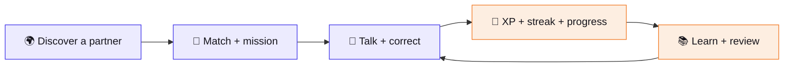
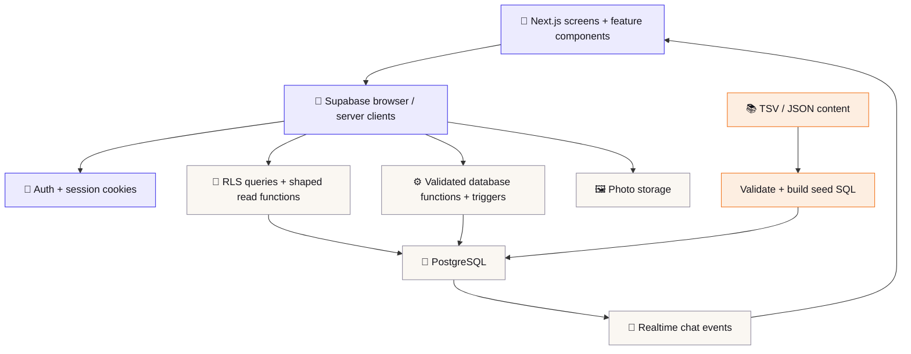

<p align="center">
  
</p>

<a id="lingua-match"></a>
# 💬 Lingua Match

**Learn a language with someone real.**

Lingua Match brings language practice and meeting people into the same loop. Find someone who speaks what you are learning, match with a conversation mission, help each other improve, and take what you learn straight into a real chat.

Language buddies, friendship, cultural exchange, and dating are separate intentions. **Dating is optional**, and discovery preferences can filter it out entirely. The app is designed for adults in Europe and the US, with Türkiye included in the country picker.

**🌍 Five course languages · 📚 A1–B1 practice · 🤝 Human corrections · 🏆 XP rankings · 📱 Web + PWA + Android APK**

**Explore:** [✨ Features](#features) · [🚀 Setup](#get-started) · [📚 Learning](#learning) · [🧰 Stack](#stack) · [🏗️ Architecture](#architecture) · [🔐 Privacy](#privacy) · [📦 Deployment](#deployment) · [🧪 Development](#development) · [🛠️ Troubleshooting](#troubleshooting) · [📖 Docs](#docs)

> [!TIP]
> **New here?** Start with the product loop below, then follow setup for a working development environment. Authentication and app data need a configured Supabase project; there is no mock backend mode.

---

## 🌱 Meet. Learn. Talk. Grow.

| **1 · Meet 🌍** | **2 · Match 🤝** | **3 · Practise 📚** | **4 · Use it 💬** |
| :--- | :--- | :--- | :--- |
| Choose your languages and discover compatible people. | Like each other and receive a first conversation mission. | Complete lessons, review due words, and try challenges. | Send a learned phrase, suggest corrections, and build XP together. |



For example, an English speaker learning Spanish can meet a Spanish speaker learning English. A mission gives them a starting topic; lessons supply useful phrases; corrections turn the conversation into practice.

<a id="features"></a>
## ✨ What you can do

The main navigation is **Discover · Matches · Learn · Messages · Profile**. Phones use bottom navigation; wider screens use a side navigation layout. The interface follows the device's light or dark preference.

| Experience | Implemented behavior |
| :--- | :--- |
| 🔑 **Create an account** | Email/password signup and login, email-confirmation screen, and Google/Apple OAuth buttons. Social providers need their own Supabase configuration. |
| 👋 **Build your profile** | Eight onboarding steps: basics, location, languages, photos, interests, bio, preferences, and completion. |
| 🌍 **Discover partners** | Profile cards, like/pass actions, language compatibility, and age, country, and intention preferences. |
| 🤝 **Start with a mission** | Mutual likes create a match; its first mission is assigned in the same database call. |
| 💬 **Have a conversation** | Paginated text messages, live updates while a chat is open, and mission progression. |
| ✏️ **Help each other improve** | Suggest a correction to a partner's message. The corrector and original author receive XP through database logic. |
| 📚 **Follow a course** | German, Spanish, Dutch, Turkish, and English courses with A1–B1 units, skills, lessons, and mastery progress. |
| 🔁 **Remember what you learn** | A Leitner review queue schedules concepts for spaced repetition. |
| 🎮 **Try challenges** | Seven challenge templates, including graded exercises and partner-led practice. |
| 🏆 **See your progress** | XP, levels, streaks, and a leaderboard with the top 50 eligible profiles plus your own standing. |
| 🗣️ **Take learning into chat** | “Ask a match” opens a learned phrase in the chat composer. You choose whether to edit and send it. |
| 🛡️ **Control your experience** | Report or block from chat; manage blocked people in settings. Blocking ends the match and hides both users from each other's discovery. |
| 📱 **Install the app** | Device-aware home-screen instructions, browser installation where supported, and an Android APK build workflow. |

### A few details that matter

- **Profiles support up to six photos.** Uploads produce a full image and a thumbnail in the browser.
- **Birth dates stay out of other people's profile cards.** Public-facing profile functions return a computed age.
- **Leaderboard ties share a rank.** Blocked people are excluded in both directions, so rankings reflect the eligible profiles visible to the viewer. Entries open a shaped profile card.
- **Open practice is self-confirmed.** Conversation, voice, correction, and partner prompts do not claim to grade free-form language. A voice challenge is a practice instruction; it is not a built-in voice-call or recording system.

<a id="get-started"></a>
## 🚀 Get started

Use **Node.js 22.18+ within the Node 22 line**, npm, and a Supabase project. [`.nvmrc`](.nvmrc) selects Node 22; content scripts run TypeScript directly using Node's type stripping. Database CLI setup needs the Supabase CLI; terminal seeding needs `psql`.

### 1 · Get the code and dependencies

```bash
git clone https://github.com/andaykhvc/dating_app.git
cd dating_app
nvm install
nvm use
npm ci
```

If you do not use nvm, install a compatible Node version and run `npm ci` directly.

### 2 · Configure the app

Create `.env.local` in the repository root with your project's values:

```dotenv
NEXT_PUBLIC_SUPABASE_URL=https://YOUR_PROJECT_REF.supabase.co
NEXT_PUBLIC_SUPABASE_ANON_KEY=YOUR_PUBLIC_CLIENT_KEY
```

| Variable | Purpose |
| :--- | :--- |
| `NEXT_PUBLIC_SITE_URL` | Optional. The public origin of the deployed site (e.g. `https://example.com`), used for auth-email and OAuth return links and absolute metadata URLs. Unset, the current page's origin is used (and `http://localhost:3000` where there is none), so local development needs nothing. See [Moving to your own domain](docs/domain-setup.md). |
| `NEXT_PUBLIC_SUPABASE_URL` | Project URL used by the browser and server Supabase clients, and photo URLs. |
| `SUPABASE_SERVICE_ROLE_KEY` | **Server-only secret** (never `NEXT_PUBLIC_`). Needed only for in-app account deletion (`/api/account/delete`), which removes the user's photo files and their auth row. Find it in Supabase → Project Settings → API (the `service_role` / secret key). Without it, "Delete account" answers "not available right now". Set it as a Vercel environment variable (Production, and Preview if you test there); never commit it. |
| `NEXT_PUBLIC_SUPABASE_ANON_KEY` | Public client API key. The existing variable name is retained; it can hold the project's publishable key or compatible legacy anon key. |
| `NEXT_PUBLIC_SUPPORT_EMAIL` | Optional. The address shown on the Help & safety page and the suspended-account screen. Defaults to `contact@linguamatch.online`; set it only to override. |

`NEXT_PUBLIC_*` values are included in the browser bundle. The app uses public client credentials and authenticated sessions; **a secret/service-role key does not belong in any `NEXT_PUBLIC_*` variable** (the server-only `SUPABASE_SERVICE_ROLE_KEY` above is the one exception, read only on the server). Database deployment credentials belong in the separate workflow secret described below.

Privacy information is public at [`/datenschutz`](https://dating-app-ruddy.vercel.app/datenschutz) (German primary edition) and [`/privacy`](https://dating-app-ruddy.vercel.app/privacy) (English). These routes use static content and bypass session refresh. They remain visibly **DRAFT — pending legal review** and `noindex` until the factual and legal review is complete.

[`src/lib/legal.ts`](src/lib/legal.ts) holds the owner-supplied public name/address/email/phone, unconfirmed conditional fields and the single `LEGAL_DRAFT_MODE` switch. The confirmed email defaults to `contact@linguamatch.online` and the phone to `+491782943998`; all six legal pages share these facts and the clickable `tel:` link. `NEXT_PUBLIC_LEGAL_EMAIL` and `NEXT_PUBLIC_LEGAL_PHONE` override them; `NEXT_PUBLIC_LEGAL_PRIVACY_EMAIL` optionally supplies a separate privacy inbox. `NEXT_PUBLIC_LEGAL_NAME`, `NEXT_PUBLIC_LEGAL_ADDRESS` (with real newlines), and `NEXT_PUBLIC_LEGAL_DPO` override other public details. Explicitly empty overrides clear a field. `NEXT_PUBLIC_SITE_URL` sets the canonical site origin; rebuild after changing any of these public variables.

The [review notes](docs/compliance/privacy-policy-review.md) trace statements to source files and list unresolved provider/region, retention, cookie and consent questions. Updating the notice does not implement account deletion or data export.

Terms are public at `/nutzungsbedingungen` (German primary edition) and `/terms` (English companion), using the same static legal layout, operator contact details and draft/noindex gate. Both editions share `TERMS_VERSION` in [`terms.config.ts`](src/content/legal/terms.config.ts); displaying a version does not record acceptance. The [terms review notes](docs/compliance/terms-review.md) map community rules to actual report reasons, distinguish implemented controls from pending moderation work, and record current legal sources and outstanding approval items. The owner currently runs the app alone as an unpaid hobby; its legal classification remains subject to review.

The provider notice is public at `/impressum` (German) and `/imprint` (English). The root footer links all six legal pages on public, authentication, onboarding and app screens; Settings also retains its legal card. Missing or unconfirmed imprint fields show **MISSING**, and an incomplete imprint remains `noindex` even if draft mode is switched off. The [imprint review notes](docs/compliance/imprint-review.md) explain every configuration variable and the conditional register, tax-ID, professional and editorial decisions.

**Before a public release**, run `npm run legal:check` with the same exported `NEXT_PUBLIC_LEGAL_*` values used by the production build. This plain Node command fails for missing required facts, unconfirmed applicability or draft mode; it is deliberately outside default CI. It does not automatically load `.env` files. Confirm actual contact-channel availability, complete the review of all three documents, set `NEXT_PUBLIC_LEGAL_DRAFT_MODE=false` only after approval, then check and rebuild. See the review notes for a local `.env` command and the [German marketing checklist](docs/compliance/marketing-germany.md) before implementing #14/#15.

### 3 · Create the database schema

Create a project in the [Supabase dashboard](https://supabase.com/dashboard), then link this checkout and apply its migrations:

```bash
npx supabase login
npx supabase link --project-ref YOUR_PROJECT_REF
bash scripts/db/check-migration-versions.sh
npx supabase db push
```

CI and the database deployment workflow pin Supabase CLI **2.118.0**. Use that version when reproducing their behavior. Migrations cover profiles, matching, chat, challenges, missions, progress, storage, the learning engine, security fixes, and XP rankings. Every filename's numeric version must be unique.

### 4 · Load the seed content

Migrations create the schema; seeds populate reference data and lessons. For a **new database**, load all seed files in filename order using the SQL Editor or `psql`:

```bash
# DATABASE_URL is your database connection string, used only by psql.
for file in supabase/seed/*.sql; do
  psql -X -v ON_ERROR_STOP=1 "$DATABASE_URL" -1 -f "$file" || break
done
```

Check that every file finishes successfully before continuing. Use the project connection string from Supabase's **Connect** dialog; a session-pooler connection is suitable when your environment cannot reach the direct database host.

| Seed group | Contents | Repeat behavior |
| :--- | :--- | :--- |
| `0001`–`0007` | Languages, interests, seven challenge templates, mission templates, and original challenge content. | First setup only; not designed for repeated loading. |
| `0010`–`0014` | Sources, curriculum, concepts, translations, and generated lessons. | Upserts on stable keys; can be reapplied after rebuilding content. |

For an **existing project**, follow [Deploying database changes](docs/deploying-the-database.md). Its workflow loads course seeds only; it does not replace the initial reference-data setup.

### 5 · Configure authentication

In Supabase Auth's **URL Configuration**, set the Site URL to your app origin and allow these callback URLs for the environments you use:

```text
http://localhost:3000/auth/callback
https://YOUR_DEPLOYED_DOMAIN/auth/callback
```

Email confirmation leads to `/verify-email` until the user follows their email link. For Google and Apple login, enable each provider and configure its credentials in Supabase. The provider's redirect URI is the Supabase Auth callback shown in that provider's dashboard setup; the app's `/auth/callback` is the subsequent return destination. See [Supabase redirect configuration](https://supabase.com/docs/guides/auth/redirect-urls).

### 6 · Run the app

```bash
npm run dev
```

Open [localhost:3000](http://localhost:3000). Complete onboarding to enter the authenticated app.

To try the social loop, create **two accounts in separate browser sessions** with complementary languages. Complete both profiles, like each other, open the match, send a message, and suggest a correction. Then complete a lesson and use “Ask a match” to take a phrase into that chat.

### 7 · Generate database types when ready

[`src/types/database.types.ts`](src/types/database.types.ts) is currently a placeholder. Generate it from your linked database:

```bash
npx supabase gen types typescript --linked > src/types/database.types.ts
```

Then wire `Database` into the Supabase client generics in [`src/lib/supabase/`](src/lib/supabase/). Generation alone does not make the existing query builders typed; RPC results currently use the handwritten domain contracts.

<a id="learning"></a>
## 📚 A course that leads back to people

The Learn tab lives at `/play`. Its committed content contains **19 units · 59 skills · 173 lessons · 1,106 concepts per language**, across German, Spanish, Dutch, Turkish, and English. A concept can be a word, phrase, or sentence.

### One meaning, many learning directions

The course stores a concept once, then adds translations per language. “Coffee” can become `der Kaffee`, `el café`, `de koffie`, `kahve`, and `coffee`. The same rows support different source/target directions without maintaining a separate course for every pair.

Postgres generates lesson exercises from available concepts, selects plausible distractors, keeps grading keys server-side, and records answers. Incorrect exercises can return later in the session; scoring uses first attempts. Text grading handles case, punctuation, spacing, accepted alternatives, and accent-only differences.

<details>
<summary>🎮 The 13 course exercise mechanics</summary>

| Mechanic | Practice |
| :--- | :--- |
| New words | Meet words and meanings before answering. |
| What does it mean? | Choose a word's meaning. |
| How do you say it? | Recall the target-language word. |
| Match the pairs | Connect words to meanings. |
| Type it | Type a translation. |
| Listen and pick | Hear a word or sentence and choose its text. |
| Type what you hear | Dictation. |
| Fill the gap | Complete a sentence. |
| Build the sentence | Put shuffled tiles in order. |
| Translate it | Build a translation with a word bank and decoys. |
| Which translation? | Choose a sentence's meaning. |
| True or false | Judge a proposed translation. |
| What would you say? | Choose a phrase for a situation. |

Listening uses the browser's speech synthesis, preferring an appropriate local voice when available. Voice availability and quality vary by device. Lessons fall back to other mechanics when there is no suitable voice; the app does not provide pronunciation scoring or a paid TTS integration.

</details>

### Review, XP, and streaks

The **Leitner system** tracks each learner's concepts in boxes 0–5. Due items answered correctly advance through intervals of 1, 3, 7, 14, and 30 days. Wrong answers move down two boxes and return after 10 minutes. Repeating an item before it is due does not promote its box.

| Action | XP |
| :--- | ---: |
| First lesson completion | 15 |
| Replayed lesson | 5 |
| Review session | 10 |
| Perfect lesson/review session | +5 |
| Learned phrase actually sent to a match | +10, up to three rewarded shares daily |
| Correction given | 10 |
| Correction received | 5 |

Lessons and reviews require at least half of first attempts to be correct to earn XP. A weaker session still updates practice progress. Mission and challenge rewards come from their configured templates. `grant_xp()` maintains the shared XP ledger, level, and streak; each **100 XP** advances a level. Bronze covers levels 1–4, silver 5–9, and gold 10 onward.

A streak day means earning XP on that **UTC calendar day**. Opening the app alone does not count. Consecutive days increase the streak; a gap starts it again at one, while the longest streak remains recorded.

“Ask a match” pre-fills an editable composer. Opening it does not send anything or earn phrase-sharing XP; the database awards that reward when the corresponding phrase is actually sent.

### Challenges alongside the course

The original challenge engine has **seven templates**: missing word, translation choice, word order, ask your partner, conversation mission, voice challenge, and correction challenge. The first three are graded in Postgres; the remaining four are self-confirmed practice. Adding content for an existing mechanic requires data, while a new mechanic requires a renderer and a database contract.

### Grow the library

```bash
npm run content:validate
npm run content:build
```

Edit TSV/JSON under [`content/`](content/), validate it, rebuild `supabase/seed/001*_learn_*.sql`, and apply the course seeds. Stable keys preserve learner progress; removed curriculum items become inactive rather than losing their history.

Offline importers support **CLDR, Tatoeba, and Wikidata**. Imports pass validation and need editorial review before publication. Every text records source and licence information; `/licenses` displays database-backed attributions. The app does not call those datasets or an AI service during lessons.

For schemas, importer commands, quality rules, licensing, adding languages, and exercise generation, read [the content-system guide](docs/content-system.md) and [the content authoring reference](content/README.md).

<a id="stack"></a>
## 🧰 Under the hood

| Layer | Technology |
| :--- | :--- |
| 🌐 App | Next.js 16.4.0 App Router · React 19.2.8 · TypeScript |
| 🎨 Interface | Tailwind CSS 4 · shared design tokens · custom icons · responsive light/dark layouts |
| ☁️ Backend | Supabase Auth · PostgreSQL · Data API/RPC · Storage · Realtime |
| 🔐 Access | Row Level Security, database grants, and validated privileged functions |
| 📱 Installation | Web app manifest · browser install guidance · Bubblewrap Trusted Web Activity for Android |
| 📚 Content tooling | Node TypeScript scripts · TSV/JSON sources · generated SQL seeds |
| 🧪 Checks | Node test runner · ESLint · TypeScript · SQL suites · GitHub Actions |
| 📦 Hosting | Vercel web deployment and GitHub workflows for database/APK releases |

Dependency versions and scripts live in [`package.json`](package.json), [`android/package.json`](android/package.json), and their committed lockfiles.

<a id="architecture"></a>
## 🏗️ How the system fits together



Routes compose screens; features own their behavior. Most data work is either an RLS-protected query or a Postgres RPC. The app's sole Route Handler is the Supabase auth callback. [`src/proxy.ts`](src/proxy.ts) refreshes sessions and gates private routes; authenticated layouts check onboarding completion.

| Directory | Responsibility |
| :--- | :--- |
| [`src/app/`](src/app/) | Landing/auth routes, eight onboarding screens, authenticated routes, manifest, and licences page. |
| [`src/features/`](src/features/) | Auth, onboarding, discovery, matching, chat, games, learning, progress, profile, and installation. |
| [`src/components/`](src/components/) | Shared UI, icons, marketing elements, and navigation. |
| [`src/lib/`](src/lib/) · [`src/types/`](src/types/) | Supabase clients, query helpers, dates, photos, constants, and domain contracts. |
| [`content/`](content/) | Course sources, languages, curriculum, source registry, and content rules. |
| [`scripts/content/`](scripts/content/) | Import, validate, derive lessons, and build SQL. |
| [`supabase/migrations/`](supabase/migrations/) · [`supabase/seed/`](supabase/seed/) | Ordered schema changes and reference/course data. |
| [`supabase/tests/`](supabase/tests/) | Learning and leaderboard SQL checks plus the scratch-database runner. |
| [`scripts/db/`](scripts/db/) · [`.github/workflows/`](.github/workflows/) | Migration-version checks, database deployment, CI, and Android releases. |
| [`android/`](android/) | TWA manifest and Android project generator; generated Gradle files are not committed. |
| [`docs/`](docs/) | Content architecture, licensing research, database deployment, and README artwork. |

<details>
<summary>🧭 Route map</summary>

| Route | Purpose |
| :--- | :--- |
| `/` | Marketing entry point; signed-in users are directed into the app. |
| `/login`, `/signup`, `/verify-email` | Authentication and email-confirmation guidance. |
| `/auth/callback` | Exchange the authentication code and redirect. |
| `/onboarding/*` | Complete profile setup. |
| `/discover`, `/matches` | Browse people and open matched partners. |
| `/messages`, `/messages/[matchId]` | Conversation list and individual chat. |
| `/play` | Course, reviews, and challenge hub. |
| `/play/lesson/[sessionId]`, `/play/session/[sessionId]` | Course lesson and original challenge players. |
| `/play/rankings`, `/play/rankings/[userId]` | XP standings and an eligible profile card. |
| `/profile`, `/profile/edit`, `/profile/settings` | Profile, editing, installation, blocked people, and sign out. |
| `/licenses` | Learning-content licences and attributions. |
| `/datenschutz`, `/privacy` | Public privacy notice, German and English. |
| `/nutzungsbedingungen`, `/terms` | Public terms and community rules, German and English. |
| `/impressum`, `/imprint` | Public provider identity and contact, German and English. |

</details>

### Important database entry points

| Area | Functions |
| :--- | :--- |
| Discovery and matching | `discover_profiles`, `get_profile_card`, `record_swipe`, `get_matches` |
| Conversations and safety | `advance_match_mission`, `block_user`, `get_blocked_users` |
| Challenges | `start_game_session`, `get_game_session`, `complete_game_session` |
| Lessons and review | `get_learn_overview`, `start_lesson`, `start_review`, `get_lesson_session`, `answer_lesson_exercise`, `complete_lesson_session` |
| Sharing and feedback | `share_phrase_with_match`, `flag_lesson_content`, `get_content_attributions` |
| Competition | `get_xp_leaderboard` |

`record_swipe()` records the action, checks for a reverse like, creates the uniquely ordered pair when appropriate, and assigns a mission for a newly created match. The unique pair constraint prevents duplicate match rows. Messaging and corrections use guarded table writes, with triggers handling associated rewards.

<a id="privacy"></a>
## 🔐 Privacy and the trust boundary

The browser submits user actions; the database controls access and rewards.

| Data or action | Boundary |
| :--- | :--- |
| **Profile rows** | Own-row access. Other people are returned through shaped functions that select the intended fields. |
| **Location** | City and country only; the profile model does not store GPS coordinates. |
| **Chat** | Match-participant access; realtime events follow table permissions and RLS. |
| **XP and progress** | No direct client write policies. Validated functions and triggers grant rewards. |
| **Answer keys** | Challenge payloads and lesson sessions are served through functions that withhold grading keys before submission. |
| **Leaderboard** | Authenticated, active, onboarded users; both directions of blocking are respected. The privileged implementation lives in `private`, behind a public invoker wrapper. |
| **Photos** | The storage bucket is public for rendering. Upload/delete permissions are owner-scoped; an image URL can still be viewed by anyone who has it. |

Age checks exist in signup and database profile/onboarding validation. They enforce the app's **18+ rule**, but do not constitute identity or age verification. Reports are stored for manual review in Supabase Studio. The photo-verification flag exists in the schema; a complete photo-verification flow is not implemented.

### Designed to keep resource use small

The project targets a small footprint on Supabase and Vercel. Plan limits and suitability depend on your deployment; the architecture does not guarantee zero hosting cost.

- **Photo processing happens in the browser:** up to 1280px WebP for full images and 320px thumbnails for lists and avatars.
- **One chat subscription per open thread:** conversation lists do not create a channel for every match.
- **Shaped reads reduce waterfalls:** database functions return screen-oriented results.
- **Messages use keyset pagination:** batches are 30 messages, based on the bigint message ID.
- **Progress is pre-aggregated:** screens read a progress row instead of summing the entire XP ledger.
- **Runtime dependencies stay small:** Next.js, React, React DOM, and the two Supabase packages. No AI service, paid translation API, or app-managed paid TTS service is required.

<a id="deployment"></a>
## 📦 Web, home screen, and Android

### Web deployment

Import this repository into Vercel, configure both `NEXT_PUBLIC_SUPABASE_*` variables for the relevant environments, and deploy. Set Supabase's Site URL and allowed callback URLs to match the deployed origin. Public environment changes require a new web build.

The Android configuration currently points to [dating-app-ruddy.vercel.app](https://dating-app-ruddy.vercel.app). This is the committed deployment target; remote deployment health needs a separate check. To move to your own domain (including a new Android release, since the host is baked into the APK), follow [docs/domain-setup.md](docs/domain-setup.md).

### Database updates

The **Deploy database** GitHub workflow runs manually. It requires the repository secret `SUPABASE_DB_URL`, applies pending migrations, and optionally reapplies course seeds.

1. In **Use workflow from**, select `main` unless you are deliberately testing another branch. If the selected branch lacks migrations already recorded in the database, the workflow stops before applying changes and explains how to proceed.
2. Keep **1. Dry run** enabled for the first run: it lists the planned changes without writing them.
3. Keep **2. Also load the course content** enabled when updating lessons and translations; course seeds are safe to repeat.
4. Leave **3. mark_applied_through** empty during normal updates.
5. Inspect the run summary, then run again with **Dry run** disabled to apply the intended update.

If a database was originally created by pasting SQL without migration history, follow the deployment guide's `mark_applied_through` recovery instructions. That input is for a verified history-repair case; it is not a normal update setting.

Read [the deployment guide](docs/deploying-the-database.md) for the session-pooler connection string, initial history handling, workflow inputs, and terminal equivalent. Web and database deployments are separate operations.

### Add to Home Screen

The final onboarding screen and **Settings → Add to Home Screen** share the installation guide. Supported Chromium browsers can open the native install prompt when the browser offers it; otherwise the guide shows manual steps. iPhone/iPad users receive Safari's **Share → Add to Home Screen** instructions. Desktop guidance and manual device selection are included.

Installation is optional. The manifest launches installed users at `/discover`, and detected standalone mode changes the guide to a ready state. **There is no service worker or offline data cache**; the app still needs a connection.

### Android APK

The Android package is a **Trusted Web Activity (TWA)** generated with Bubblewrap. It opens the deployed site through a supporting browser, with a custom-tab fallback. Web updates reach the installed app through the website; it is not a separate React Native implementation.

To release, open **Actions → Android APK → Run workflow**, optionally enter a version, and download `lingua-match-<version>.apk` from the resulting [GitHub Release](https://github.com/andaykhvc/dating_app/releases). The workflow runs **on demand only**: pushes, tags, and pull requests do not start an APK build. The manual run creates the `android-v<version>` release tag.

| Repository secret | Purpose |
| :--- | :--- |
| `ANDROID_KEYSTORE_BASE64` | Base64-encoded signing keystore. |
| `ANDROID_KEYSTORE_PASSWORD` | Keystore password. |
| `ANDROID_KEY_ALIAS` | Signing key alias. |
| `ANDROID_KEY_PASSWORD` | Signing key password. |

The workflow generates a Gradle project, builds, aligns, signs, verifies the certificate fingerprint, and uploads the APK. All four signing secrets must be configured before starting it.

Keep the signing key backed up: updates must use the same signing identity. [`public/.well-known/assetlinks.json`](public/.well-known/assetlinks.json) binds the domain to `com.linguamatch.app` and its SHA-256 signing fingerprint; the workflow rejects a certificate mismatch. The deployed site's association must also be valid to hide browser chrome.

For a domain change, update the host and all related URLs in [`android/twa-manifest.json`](android/twa-manifest.json), deploy the association file on that origin, and verify the installed app. This repository provides an APK release path; it does not include a Google Play publishing pipeline or native iOS package.

<a id="development"></a>
## 🧪 Development and verification

### Everyday checks

```bash
npm run typecheck
npm run lint
npm test
npm run content:validate
npm run build
```

`typecheck` runs `next typegen` before TypeScript, so route types are generated first. For a production build, configure the same public Supabase variables used by the app.

| Command | What it does |
| :--- | :--- |
| `npm run dev` | Start the local Next.js development server. |
| `npm run build` · `npm start` | Build and serve the production app. |
| `npm run typecheck` · `npm run lint` | Check TypeScript/route types and ESLint rules. |
| `npm test` | Content-pipeline, app-installation, and lint-glob compatibility tests. |
| `npm run content:validate` · `npm run content:build` | Validate sources and generate course SQL. |
| `npm run content:import:cldr` | Generate CLDR-derived content. |
| `npm run content:import:tatoeba` · `npm run content:import:wikidata` | Run dataset importers with the arguments in the content-system guide. |
| `npm run test:db` | Recreate a scratch Postgres database, load migrations/seeds, and run SQL suites. |

<details>
<summary>🐘 Database checks</summary>

For the standalone SQL runner, start a **disposable local PostgreSQL instance** with `psql` available and a role allowed to create databases:

```bash
PGHOST=/tmp PGPORT=5432 PGUSER=postgres npm run test:db
```

The runner drops and recreates `lingua_match_test` by default (`TEST_DB` can override the name), installs a lightweight Supabase test shim, applies all migrations/seeds, then runs the learning-engine and leaderboard suites. Point it only at the intended test server. It does not reproduce the full Auth, Storage, or Realtime services.

CI separately boots a local Supabase database container, applies migration history from scratch, lints the schema, and runs leaderboard access tests. That path requires Docker and uses the Supabase database image; it does not contact your hosted project.

</details>

### What CI checks

On PRs into `main` and pushes to `main`, [CI](.github/workflows/ci.yml) checks types and Node tests, lint, a build with placeholder credentials, high/critical dependency advisories, tracked environment files, unique migration versions, and the local database checks above. A passing build with placeholders does not prove that a live project is configured correctly.

The scoped `@next/eslint-plugin-next` → `fast-glob` override replaces that caller's glob library with `tinyglobby`. Its compatibility test checks directory matching and the internal-link rule. Keep it scoped; the libraries' other options are not interchangeable.

### Verify the actual experience

For a configured development project, walk through **signup → confirmation → onboarding → discovery → mutual match → mission → message → correction → lesson → review → phrase share → rankings → block**. Check that blocked profiles disappear from discovery and rankings and that the match ends. Test installation and authentication on physical iOS Safari and Android Chrome, then repeat the relevant flow through the signed APK.

For contributions, keep feature logic out of route files, preserve shaped profile reads, keep grading and rewards in trusted database code, and regenerate course seeds with content changes. Before changing Next.js code, follow [`AGENTS.md`](AGENTS.md) and read the matching guide in the installed Next.js documentation.

<a id="troubleshooting"></a>
## 🛠️ When something does not work

| Symptom | First things to check |
| :--- | :--- |
| App fails on Supabase configuration | Both public variables exist in root `.env.local`; restart the dev server after editing them. On hosting, rebuild after changing public values. |
| Google/Apple login fails or returns to the wrong place | Provider enabled, provider credentials configured, Supabase callback registered with the provider, and app callback allowed in Auth URL Configuration. |
| Signup goes to email verification | Confirmation is enabled; follow the email link before entering the app. |
| Discover is empty | Another active, onboarded profile exists with compatible languages and preferences; neither account has blocked the other. |
| Learn has no course or missing lessons | Selected target/source languages have active content; migrations and course seeds were both applied. |
| Listening exercises are absent | The browser may have no matching speech voice. The course intentionally falls back to other exercise types. |
| Chat messages need refresh | Check the open-thread subscription and Realtime publication for `messages` and `message_corrections`; conversation lists have no live subscriptions. |
| Migration deployment fails | Run the migration-version check, inspect the dry run, and compare remote history with the repository. Use the history-repair guide only when applicable. |
| Android signing fails | All four keystore secrets exist, the alias/passwords match, and the certificate matches `assetlinks.json`. |
| APK opens with a browser bar | Check the deployed Digital Asset Links file, domain/package/certificate association, and browser TWA support. |

<a id="roadmap"></a>
## 🔭 Current limits and possible next steps

These are follow-up directions, separate from implemented features:

| Area | Current limit / next step |
| :--- | :--- |
| 📚 **Editorial quality** | Expand native-speaker review. CEFR labels are editorial or estimated, not certified; there are no dedicated grammar-explanation pages yet. |
| 🌍 **More content** | Add concepts and languages through the pipeline; validate real corpus imports before publishing them. The course languages currently number five. |
| 🗣️ **Speech** | Listening depends on browser voices; pronunciation assessment, recording, and voice/video calls are not implemented. |
| 🔐 **Product safety** | Reports need manual review; full photo verification and additional moderation tooling remain future work. |
| 🧰 **Developer contracts** | Generate and wire database types; extend coverage of real Auth/Storage/Realtime and simultaneous social actions. |
| 📱 **Distribution** | Continue physical-device PWA/TWA checks. Offline operation, push notifications, native iOS, and store publishing are not implemented. |
| 💳 **Business features** | Payments, subscriptions, premium tiers, and AI features are outside the current implementation. |

<a id="docs"></a>
## 📖 Choose your next read

| Guide | What you will find |
| :--- | :--- |
| [📚 **Learning-content system**](docs/content-system.md) | Schema, pipeline, exercise generation, distractors, SRS, XP, importers, and extension recipes. |
| [✍️ **Content authoring reference**](content/README.md) | TSV columns, accepted answers, gaps, grammar metadata, and file conventions. |
| [⚖️ **Open-content licensing research**](docs/open-content-licensing.md) | Source choices, attribution requirements, and import constraints. |
| [📦 **Database deployment**](docs/deploying-the-database.md) | GitHub workflow setup, dry runs, seeds, and legacy migration-history handling. |
| [🧪 **CI workflow**](.github/workflows/ci.yml) | The exact automated checks and pinned CLI version. |
| [📱 **Android workflow**](.github/workflows/android-release.yml) | APK generation, signing, certificate validation, and release publication. |

<details>
<summary>🎨 About the README artwork</summary>

The banner is an illustration, not a screenshot. It uses the app's warm paper, indigo, and progress-orange palette from [`src/app/globals.css`](src/app/globals.css). The artwork is committed locally and has descriptive alt text; diagrams also use text labels.

Regenerate the banner with Python and Pillow:

```bash
python3 docs/assets/generate_readme_art.py
```

Learning-content source licences are recorded in the content registry and shown at `/licenses`. They are separate from a licence for the application source code; this repository currently has no root `LICENSE` file.

</details>

<p align="center"><strong>💬 Meet someone. Learn something. Say it for real.</strong></p>

[↑ Back to Lingua Match](#lingua-match)
